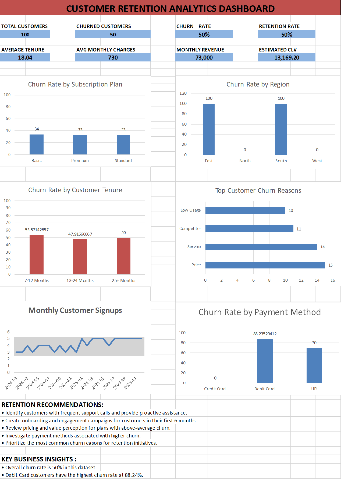

# Customer Retention Analytics

## Project Overview

This project analyzes customer retention and churn data using Python, Pandas, Matplotlib, Seaborn, and Excel.

The main objective is to identify customer churn patterns, retention performance, subscription plan behavior, regional trends, payment method impact, customer tenure, churn reasons, and high-risk customers.

## Dashboard



## Key Performance Indicators

- Total Customers: 100
- Churned Customers: 50
- Churn Rate: 50%
- Retention Rate: 50%
- Average Tenure: 18.04 months
- Average Monthly Charges: 730
- Monthly Revenue: 73,000
- Estimated CLV: 13,169.20

## Tools & Technologies

- Python
- Pandas
- Matplotlib
- Seaborn
- Microsoft Excel
- OpenPyXL

## Data Analysis Performed

### 1. Data Cleaning
- Removed duplicate records
- Cleaned text columns
- Converted signup dates into datetime format
- Converted numerical columns into numeric data types
- Removed records with missing essential values

### 2. Customer Retention Analysis

Calculated:

- Total Customers
- Churned Customers
- Retained Customers
- Churn Rate
- Retention Rate
- Average Tenure
- Average Monthly Charges
- Monthly Revenue
- Estimated Customer Lifetime Value

### 3. Subscription Plan Analysis

Analyzed:

- Customers by subscription plan
- Churned customers by plan
- Churn rate by plan
- Average charges
- Average tenure
- Revenue by plan

### 4. Regional Analysis

Compared customer performance across different regions using:

- Customer count
- Churned customers
- Churn rate
- Average charges
- Average tenure

### 5. Payment Method Analysis

Analyzed churn rates for:

- Credit Card
- Debit Card
- UPI

### 6. Customer Tenure Analysis

Customers were grouped into:

- 0–3 Months
- 4–6 Months
- 7–12 Months
- 13–24 Months
- 25+ Months

### 7. Churn Reason Analysis

Analyzed the most common customer churn reasons:

- Price
- Service
- Competitor
- Low Usage

### 8. Customer Segmentation

Customers were analyzed using age groups:

- 18–25
- 26–35
- 36–45
- 46–55
- 56+

### 9. High-Risk Customer Identification

Customers with churn status marked as "Yes" and at least 3 support calls were identified as high-risk customers.

## Visualizations

The project generates the following visualizations:

1. Churn Rate by Subscription Plan
2. Churn Rate by Region
3. Churn Rate by Customer Tenure
4. Top Churn Reasons
5. Churn Rate by Payment Method
6. Average Support Calls by Churn Status
7. Monthly Customer Signups
8. Churn Rate by Age Group
9. Customer Data Correlation Heatmap

## Key Business Insights

- Overall customer churn rate is 50%.
- Overall retention rate is 50%.
- Debit Card customers show the highest churn rate in the analyzed dataset.
- Price is the most common churn reason.
- Customers with frequent support calls are considered a higher-risk group.
- Early-tenure customers can be targeted with onboarding and engagement campaigns.

## Retention Recommendations

- Identify customers with frequent support calls and provide proactive assistance.
- Create onboarding and engagement campaigns for customers during their first 6 months.
- Review pricing and value perception for plans with above-average churn.
- Investigate payment methods associated with higher churn.
- Prioritize the most common churn reasons for retention initiatives.

## Project Structure

```text
Customer-Retention-Analytics/
│
├── customer_retention_analysis.py
├── customer_data1.xlsx
├── Customer_Retention_Report1.xlsx
├── dashboard.png
├── README.md
└── requirements.txt
